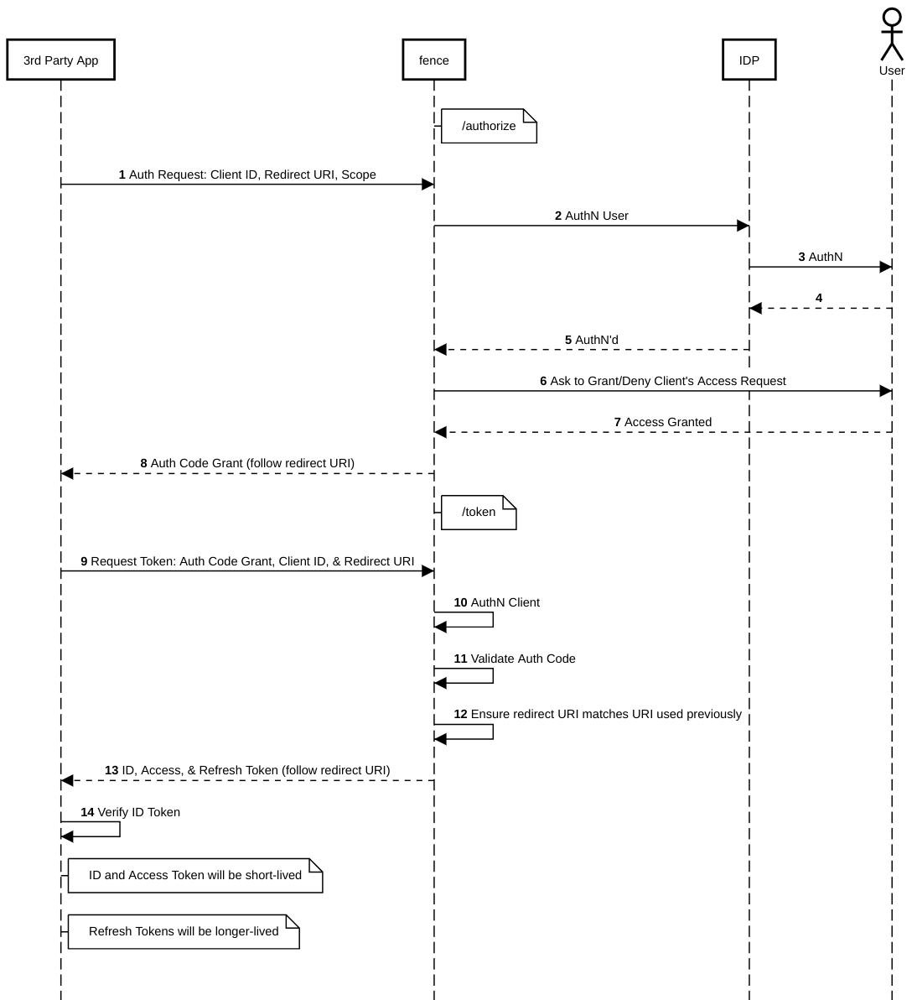
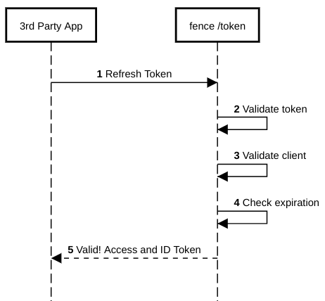
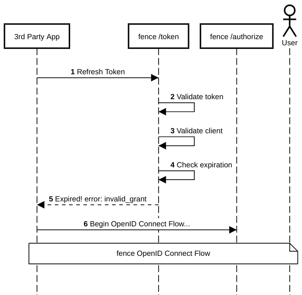

# Fence

[](https://travis-ci.org/uc-cdis/fence)
[](https://www.codacy.com/app/uc-cdis/fence?utm_source=github.com&amp;utm_medium=referral&amp;utm_content=uc-cdis/fence&amp;utm_campaign=Badge_Grade)
[](https://www.codacy.com/app/uc-cdis/fence?utm_source=github.com&utm_medium=referral&utm_content=uc-cdis/fence&utm_campaign=Badge_Coverage)

## Setup

#### Install Requirements and Fence

```bash
# Install requirements.
pip install -r requirements.txt
# Install fence in your preferred manner.
python setup.py develop
```

#### Create Local Settings

```bash
# Copy example settings to local settings and then fill them out.
cp fence/local_settings.example.py fence/local_settings.py
```
Remember to fill out `fence/local_settings.py`!

#### Set Up Databases

Because the tests clear out the database every time they are run, if you would
like to keep a persistent database for manual testing and general local usage
simply create a second test database with a different name, as in the
instructions below.

```bash
# Create test database(s).
# This one is for automated tests, which clear the database after running;
# `tests/test_settings.py` should have `fence_test_tmp` in the `DB` variable.
psql -U test postgres -c 'create database fence_test_tmp'
userdatamodel-init --db fence_test_tmp
# This one is for manual testing/general local usage; `fence/local_settings.py`
# should have `fence_test` in the `DB` variable.
psql -U test postgres -c 'create database fence_test'
userdatamodel-init --db fence_test
```

#### Create User Access File

```bash
fence-create --path fence create ua.yaml
```

#### Register OAuth Client

Using gdcapi for example:
```bash
fence-create --path fence client-create --client gdcapi --urls http://localhost/api/v0/oauth2/authorize --username test
```
That command should output a tuple of `(client_id, client_secret)` which must be
saved so that `gdcapi` (for example) can be run as an OAuth client to use with
`fence`.

## API Documentation

[OpenAPI documentation available here.](http://petstore.swagger.io/?url=https://raw.githubusercontent.com/uc-cdis/fence/master/openapi/swagger.yaml)

YAML file for the OpenAPI documentation is found in the `openapi` folder (in
the root directory); see the README in that folder for more details.

## JWT Information

### Example ID Token
```
{
  "sub": "7",
  "azp": "test-client",
  "context": {
    "user": {
      "is_admin": false,
      "name": "test",
      "projects": {
        "phs000178": [
          "read",
          "update",
          "create",
          "delete",
          "read-storage"
        ]
      }
    }
  },
  "pur": "id",
  "jti": "3ae2910b-0294-43dc-af2a-03fd60082aef",
  "aud": [
    "openid",
    "user",
    "test-client"
  ],
  "exp": 1516983302,
  "auth_time": 1516982102,
  "iss": "https://bionimbus-pdc.opensciencedatacloud.org",
  "iat": 1516982102
}
```

### Example Access Token
```
{
  "sub": "7",
  "azp": "test-client",
  "aud": [
    "openid",
    "user",
    "test-client"
  ],
  "pur": "access",
  "iss": "https://bionimbus-pdc.opensciencedatacloud.org",
  "jti": "2e6ade06-5afb-4ce7-9ab5-e206225ce291",
  "exp": 1516983302,
  "iat": 1516982102
}
```

### Example Refresh Token
```
{
  "sub": "7",
  "azp": "test-client",
  "aud": [
    "openid",
    "user",
    "test-client"
  ],
  "pur": "refresh",
  "iss": "https://bionimbus-pdc.opensciencedatacloud.org",
  "jti": "c72e5573-39fa-4391-a445-191e370b7cc5",
  "exp": 1517010902,
  "iat": 1516982102
}
```

### Keypair Configuration

Generating a keypair using `openssl`:
```bash
# Generate the private key.
openssl rsa -out private_key.pem 2048

# Generate the public key.
openssl rsa -in private_key.pem -pubout -out public_key.pem
```
(It's not a bad idea to confirm that the files actually say `RSA PRIVATE KEY`
and `PUBLIC KEY`.)

Files containing public/private keys should have this format (the format used
by `openssl` for generating RSA keys):
```
-----BEGIN PUBLIC KEY-----
... [key is here] ...
-----END PUBLIC KEY-----
```
If a key is not in this format, then `PyJWT` will raise errors about not being
able to read the key.

The variable `JWT_KEYPAIR_FILES` in `fence/settings.py` should be set up as an
ordered dictionary mapping key ids to pairs of public and private key files (in
that order); for example:
```
JWT_KEYPAIR_FILES = OrderedDict([
    ('default', ('keys/jwt_public_key.pem', 'keys/jwt_private_key.pem')),
])
```
Fence will use the first keypair in the list to sign the tokens it issues
through OAuth.

## OIDC & OAuth2

### Fence as Client

Example:

- Google IAM is the OpenID Provider (OP)
- Fence is the client
- Google Calendar API is the resource provider

### Fence as OpenID Provider (OP)

- Fence is the OpenID Provider (OP)
- A third-party application is the client
- Our microservices (e.g. [`sheepdog`](https://github.com/uc-cdis/sheepdog)) are resource providers

### Example Flows
Note that the `3rd Party App` acts as the `client` in these examples.

[//]: # (See /docs folder for README on how to regenerate these sequence diagrams)
#### Flow: Client Registration


#### Flow: OpenID Connect


#### Flow: Refresh Token Use


#### Flow: Refresh Token Use (Token is Expired)


#### Flow: ID Token Use
TODO

#### Flow: ID Token Use (Token is Expired)
TODO

If the third-party application doesn't need to use any Gen3 resources (and just
wants to verify the user), after the handshake is finished they can just get
needed information in the ID token. If they want to use gen3 resources like
`fence`/`sheepdog`/`peregrine`, they call those services with an `ID token`
passed in an `Authorization` header.

#### Notes

See the [OIDC specification](http://openid.net/specs/openid-connect-core-1_0.html) for details.
Additionally, see the [OAuth2 specification](https://tools.ietf.org/html/rfc6749) for more details.
